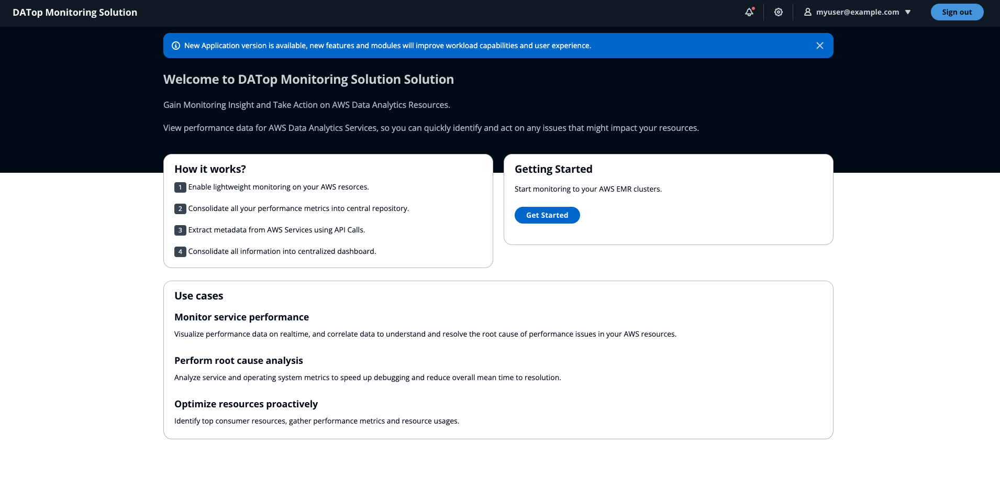
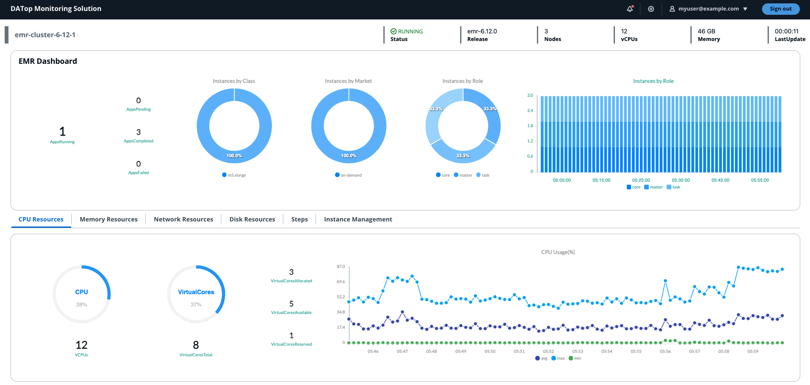
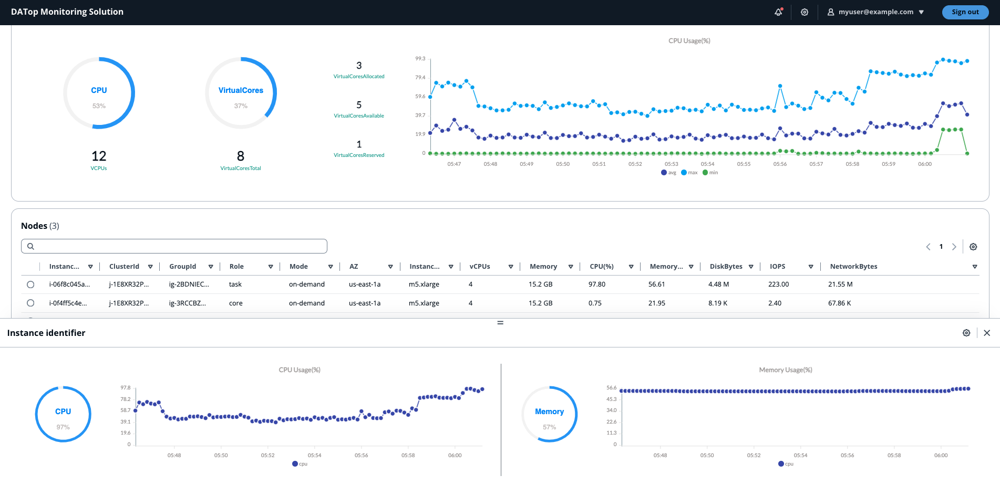
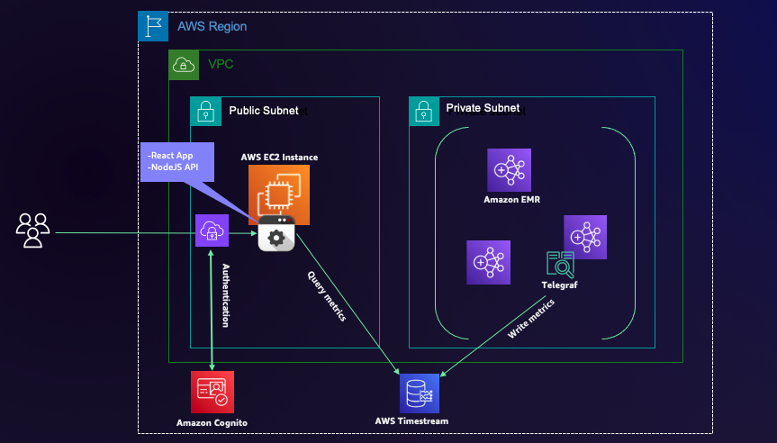

# ADTop Monitoring Solution for AWS Data Analytics Services

> **Disclaimer:** The sample code; software libraries; command line tools; proofs of concept; templates; or other related technology (including any of the foregoing that are provided by our personnel) is provided to you as AWS Content under the AWS Customer Agreement, or the relevant written agreement between you and AWS (whichever applies). You are responsible for testing, securing, and optimizing the AWS Content, such as sample code, as appropriate for production grade use based on your specific quality control practices and standards. Deploying AWS Content may incur AWS charges for creating or using AWS chargeable resources, such as running Amazon EC2 instances, using Amazon CloudWatch or Amazon Cognito.

## What is ADTop Monitoring ?

ADTop Monitoring is lightweight application to perform real-time monitoring for AWS Data Analytics Resources. 
Based on same simplicity concept of Unix top utility, provide quick and fast view of performance, just all in one screen.

## How does ADTop Monitoring look like?

### [Visit the YouTube channel for videos](https://www.youtube.com/@ADTopMonitoringSolution)

## AWS Services Support

ADTop Monitoring Solution currently supports following database services:

- [Amazon EMR Service](https://aws.amazon.com/emr/)

## Solution Components

- **Frontend.** React Developed Application to provide user interface to visualize performance information.

- **Backend.** NodeJS API Component to gather performance information from central repository and AWS Metadata

## Architecture

## Use cases

- **Monitor service performance.**
    Visualize performance data on realtime, and correlate data to understand and resolve the root cause of performance issues in your AWS resources.

- **Perform root cause analysis.**
    Analyze service and operating system metrics to speed up debugging and reduce overall mean time to resolution.

- **Optimize resources proactively.**
    Identify top consumer resources, gather performance metrics and resource usages.

## Solution Requirements

ADTop Monitoring Solution requires following resources:

- **[Amazon EMR]**. Require [Telegraf OpenSource Agent](https://github.com/influxdata/telegraf) to collect performance metrics. Add bootstraping step to configure the agent to send metrics to central repository. 
    Configuration script [emr.setup.sh](https://github.com/snunezcode/da-top-monitoring/blob/master/conf/emr.setup.sh) is located into [conf](./conf/) directory.

## Resource Usage and Cost

ADTop Monitoring Solution will use following resources:

- **AWS EC2 instance.**
     The cost of this resource will depend of size selected during the deployment process. AWS EC2 instance pricing can be review [here](https://aws.amazon.com/ec2/pricing/).

- **AWS Timestream.** 
    The cost of this resource will depend how much time the application is being used, modules usage and number of cluster nodes to monitoring. Monitoring agent will write performance metrics into AWS Timestream service. 
    ADTop Monitoring Solution will query AWS Timestream service to show performance information.
    AWS Timestream pricing can be review [here](https://aws.amazon.com/timestream/pricing/).

    

## Solution Deployment

> **Time to deploy:** Approximately 10 minutes.

### Launch CloudFormation Stack

Follow the step-by-step instructions to configure and deploy the ADTop Monitoring Solution into your account.

1. Make sure you have sign in AWS Console already.
2. Download AWS Cloudformation Template ([ADMonitoringSolution.template](https://raw.githubusercontent.com/aws-samples/ad-top-monitoring/main/conf/ADTopMonitoringSolution.template)) located into conf folder.
3. [**Open AWS CloudFormation Console**](https://console.aws.amazon.com/cloudformation/home#/stacks/create/template?stackName=ADTopMonitoringSolution)
4. Create an stack using Cloudformation template ([DBMonitoringSolution.template](/conf/DBMonitoringSolution.template)) already downloaded on step 2.
5. Input **Stack name** parameter. 
6. Acknowledge **Application Updates - Disclaimer** parameter.
7. Input **Username** parameter, this username will be used to access the application. An email will be sent with temporary password from AWS Cognito Service. 
8. Input **AWS Linux AMI** parameter, this parameter specify AWS AMI to build App EC2 Server. Keep default value.
9. Select **Instance Type** parameter, indicate what instance size is needed.
10. Select **VPC Name** parameter, indicate VPC to be used to deploy application server.
11. Select **Subnet Name** parameter, indicate subnet to be used to deploy application server, this subnet needs to have outbound internet access to reach AWS APIs. Also application server needs to be able to reach AWS Database Resources, add appropiate inboud rules on Amazon RDS security groups to allow network connections.
12. Select **Public IP Address** parameter, the deployment will assign private IP Address by default to access the application, you can assign Public IP Address to access the application in case you need it, Select (true) to assign Public IP Address.
13. Input **CIDR** parameter, specify CIDR inbound access rule, this will grant network access for the application.
14. Click **Next**, Click **Next**, select **acknowledge that AWS CloudFormation might create IAM resources with custom names**. and Click **Submit**.
15. Once Cloudformation has been deployed, gather application URL from output stack section. Username will be same you introduce on step 7 and temporary password will be sent by AWS Cognito Service.
16. Application deployment will take around 5 minutes to be completed.

> **Note:** Because you are connecting to a site with a self-signed, untrusted host certificate, your browser may display a series of security warnings. 
Override the warnings and proceed to the site. To prevent site visitors from encountering warning screens, you must obtain a trusted, 
CA-signed certificate that not only encrypts, but also publicly authenticates you as the owner of the site.

## Security

See [CONTRIBUTING](CONTRIBUTING.md#security-issue-notifications) for more information.

## License

This library is licensed under the MIT-0 License. See the [LICENSE](LICENSE.txt) file.

